# Módulos Funcionais — Keve Marketplace B2B

**Versão:** 2.0  
**Data:** jun/2026  
**Referência:** [PRD.md](./PRD.md) · [ARQUITETURA.md](./ARQUITETURA.md)

Este documento detalha cada módulo funcional: objetivo, telas, regras de negócio, entidades, integrações e critérios de aceite.

---

## Mapa de dependências

```mermaid
graph TD
    M1[M1 Landing] --> M2[M2 Auth/RBAC]
    M2 --> M3[M3 Onboarding]
    M3 --> M4[M4 Catálogo]
    M3 --> M5[M5 Demandas]
    M5 --> M6[M6 Match]
    M6 --> M7[M7 Propostas]
    M7 --> M8[M8 Chat]
    M7 --> M9[M9 Pedidos/Workflow]
    M9 --> M10[M10 Reputação]
    M2 --> M11[M11 Notificações]
    M6 --> M11
    M7 --> M11
    M8 --> M11
    M9 --> M11
    M2 --> M12[M12 Admin]
    M2 --> M13[M13 Billing]
    M13 --> M4
    M13 --> M5
    M13 --> M7
```



---

## M1 — Landing + Captação

**MVP:** ✅ · **Rotas:** `/`, `/para-compradores`, `/para-fornecedores`

### Objetivo

Converter visitantes em leads ou cadastros, comunicando o diferencial de busca reversa e capturando consentimento LGPD.

### Telas

| Tela | Conteúdo |
|------|----------|
| Home | Hero, como funciona (3 passos), depoimentos, CTA comprador/fornecedor |
| Para compradores | Benefícios, fluxo de cotação, CTA cadastro |
| Para fornecedores | Benefícios, verificação, planos, CTA cadastro |
| Footer | Termos, privacidade, contato |

### Regras de negócio

- Formulário de lead exige checkbox de consentimento LGPD
- CTA principal direciona para `/auth/register/buyer` ou `/auth/register/supplier`
- Eventos de analytics: `page_view`, `cta_click`, `lead_submit`

### Entidades

- `crm_leads` (V2 completo; MVP pode usar formulário → e-mail ou insert simples)

### Critérios de aceite

- [ ] LP responsiva mobile/desktop
- [ ] Meta tags SEO por rota
- [ ] Formulário de lead funcional com consentimento
- [ ] CTAs levam ao fluxo de cadastro correto

---

## M2 — Autenticação + RBAC

**MVP:** ✅ · **Rotas:** `/auth/login`, `/auth/register/*`, guards em rotas protegidas

### Objetivo

Autenticar usuários e controlar acesso por papel (comprador, fornecedor, comercial, admin).

### Papéis

| Papel | Código | Acesso |
|-------|--------|--------|
| Comprador | `buyer` | `/buyer/*` |
| Fornecedor | `supplier` | `/supplier/*` |
| Comercial | `commercial` | `/commercial/*` (V2) |
| Admin | `admin` | `/admin/*` |

Um usuário pode ter **múltiplos papéis** (ex.: comprador + fornecedor). Tabela `user_roles` ou array em `profiles.roles`.

### Fluxos

**Login**
1. E-mail + senha → Supabase Auth
2. Carrega `profiles` + papéis
3. Redireciona para dashboard do papel principal ou seletor se múltiplos

**Registro comprador**
1. E-mail, senha, nome, telefone
2. Cria `auth.users` + `profiles` + `buyer_profiles`
3. Atribui plano Free/Trial automaticamente

**Registro fornecedor**
1. Redireciona para M3 (onboarding completo)

**Recuperação de senha**
- Fluxo padrão Supabase Auth (e-mail reset link)

### Regras de negócio

- Sessão expira conforme config Supabase (padrão: refresh token)
- Rotas protegidas: guard verifica JWT + papel
- Fornecedor com status ≠ `aprovado` acessa `/supplier/*` limitado (só onboarding e catálogo, sem board)
- Assinatura `past_due` ou `canceled` → paywall em ações pagas (M13)

### Entidades

- `profiles`, `buyer_profiles`, `supplier_profiles`, `user_roles`

### Integrações

- Supabase Auth (e-mail/senha)
- Biometria nativa → V2 (mobile)

### Critérios de aceite

- [ ] Login/logout funcional
- [ ] Registro comprador cria perfil completo
- [ ] Guards bloqueiam acesso cruzado de papéis
- [ ] Reset de senha por e-mail

---

## M3 — Cadastro e Onboarding (Fornecedor)

**MVP:** ✅ · **Rotas:** `/auth/register/supplier`, `/supplier/onboarding`

### Objetivo

Coletar e validar dados do fornecedor (CNPJ, documentos) para aprovação admin e selo Verificado.

### Fluxo (wizard)

```
Passo 1: Dados da empresa (CNPJ → autopreenchimento)
Passo 2: Endereço e área de atuação (cidade/UF/raio)
Passo 3: Upload documentos (cartão CNPJ, comprovante endereço)
Passo 4: Categorias de atuação (multi-select)
Passo 5: Revisão e envio → status em_revisao
```

### Regras de negócio

- CNPJ validado via API externa (BrasilAPI ou similar)
- CNPJ duplicado → bloqueio (1 CNPJ = 1 fornecedor)
- Upload máx. 5 MB por arquivo; formatos: PDF, JPG, PNG
- Status: `pendente` → `em_revisao` → `aprovado` | `recusado`
- Selo **Verificado** = status `aprovado`
- Fornecedor `recusado` pode reenviar documentos (volta para `em_revisao`)
- **Não recebe matches** enquanto status ≠ `aprovado`

### Entidades

- `companies`, `supplier_profiles`, `documents`, `supplier_categories`

### Integrações

- API CNPJ (client-side ou Edge Function proxy)
- Supabase Storage bucket `documents/{user_id}/`

### Critérios de aceite

- [ ] Autopreenchimento CNPJ funcional
- [ ] Upload de documentos com preview
- [ ] Status visível no dashboard fornecedor
- [ ] Notificação ao admin quando entra em `em_revisao`

---

## M4 — Catálogo do Fornecedor

**MVP:** ✅ · **Rotas:** `/supplier/catalog`, `/supplier/catalog/new`, `/supplier/catalog/:id/edit`

### Objetivo

Permitir que fornecedores cadastrem produtos para matching com demandas.

### Telas

| Tela | Descrição |
|------|-----------|
| Lista | Grid denso de produtos com imagem pequena + título abaixo |
| Criar/Editar | Formulário modal ou página dedicada |
| Detalhe | Visualização rápida (opcional MVP) |

### Campos do produto

| Campo | Tipo | Obrigatório |
|-------|------|-------------|
| nome | string | sim |
| sku | string | não |
| category_id | uuid | sim |
| descricao | text | não |
| marca | string | não |
| preco_referencia | decimal | não |
| imagem | file/url | não |
| cidade | string | sim (herda do fornecedor por padrão) |
| ativo | boolean | sim (default true) |

### Regras de negócio

- Limite de itens = `plans.max_catalog_items` da assinatura ativa
- Ao atingir limite → paywall (M13)
- Produto inativo não entra no match
- **UX Keven:** imagem pequena (~64–80px), título **abaixo** da imagem, nunca sobreposto
- Grid: `grid-cols-2 sm:grid-cols-3 lg:grid-cols-4 xl:grid-cols-5`

### Entidades

- `products`, `categories`

### Critérios de aceite

- [ ] CRUD completo de produtos
- [ ] Limite de catálogo respeitado por plano
- [ ] Grid responsivo conforme spec UX
- [ ] Upload de imagem para Storage

---

## M5 — Busca Reversa (Demandas)

**MVP:** ✅ · **Rotas:** `/buyer/dashboard`, `/buyer/demands/new`, `/buyer/demands/:id`

### Objetivo

Comprador publica demanda de produto/serviço; sistema dispara match com fornecedores elegíveis.

### Fluxo

```
Criar demanda (RASCUNHO)
  → Revisar e publicar (PUBLICADA)
  → Edge Function match-demand
  → Fornecedores notificados
  → Propostas chegam (M7)
  → Comprador vê tudo agrupado na mesma tela
```

### Campos da demanda

| Campo | Tipo | Obrigatório |
|-------|------|-------------|
| titulo | string | sim |
| descricao | text | sim |
| category_id | uuid | sim |
| quantidade | integer | sim |
| unidade | string | sim (un, cx, kg…) |
| cidade | string | sim |
| uf | string(2) | sim |
| raio_km | integer | não (default 50) |
| prazo_desejado | date | não |
| observacoes | text | não |
| anexos | file[] | não |

### Regras de negócio

- Cota mensal = `plans.max_demands_monthly` (contador resetado no dia 1)
- Geolocalização web sugere cidade/UF (browser API); usuário pode editar
- Demanda `RASCUNHO` visível só para o comprador
- Ao publicar → trigger match + incrementa contador mensal
- Comprador pode cancelar demanda sem proposta aceita → status `CANCELADO`
- Demanda expira após N dias sem proposta aceita (configurável, default 30 dias)

### Entidades

- `demands`, `demand_attachments`, `usage_counters`

### Integrações

- Edge Function `match-demand` (via DB trigger)
- Browser Geolocation API

### Critérios de aceite

- [ ] Criar, editar rascunho, publicar demanda
- [ ] Cota mensal validada antes de publicar
- [ ] Cidade sugerida por geolocalização
- [ ] Tela de detalhe agrupa propostas (M7) na mesma view

---

## M6 — Motor de Match

**MVP:** ✅ · **Backend:** Edge Function + tabela `demand_matches`

### Objetivo

Identificar fornecedores elegíveis para cada demanda publicada e notificá-los.

### Algoritmo (MVP)

```
Para demanda D publicada:
  1. Filtrar fornecedores com status = aprovado
  2. Filtrar por category_id (produto na categoria OU supplier_categories)
  3. Filtrar por localização (mesma cidade OU distância ≤ raio_km)
  4. Ordenar: plano Gold primeiro → reputação desc → data cadastro asc
  5. Criar registros em demand_matches (demand_id, supplier_id, score)
  6. Notificar cada fornecedor (M11) — 1 notificação por demanda
```

### Score de match (referência)

| Critério | Peso |
|----------|------|
| Categoria exata no catálogo | +40 |
| Categoria nas tags do fornecedor | +20 |
| Mesma cidade | +30 |
| Dentro do raio | +10 a +25 ( proporcional ) |
| Plano Gold | +15 (prioridade fila) |
| Reputação ≥ 4.0 | +5 |

### Regras de negócio

- Fornecedor não aprovado → excluído
- Fornecedor sem categoria compatível → excluído
- Match idempotente: reprocessar mesma demanda não duplica `demand_matches`
- Fornecedor vê oportunidades em `/supplier/board` (M7 entrada)

### Entidades

- `demand_matches`, `supplier_categories`

### Integrações

- Edge Function `match-demand`
- Notificações M11

### Critérios de aceite

- [ ] Match dispara automaticamente ao publicar demanda
- [ ] Apenas fornecedores elegíveis recebem oportunidade
- [ ] Gold recebe prioridade na ordem de notificação
- [ ] Board do fornecedor lista matches pendentes

---

## M7 — Propostas (Contrapropostas)

**MVP:** ✅ · **Rotas:** `/supplier/board`, `/supplier/offers/:demandId`, `/buyer/demands/:id` (painel propostas)

### Objetivo

Fornecedor envia proposta comercial; comprador compara todas na mesma tela.

### Fluxo fornecedor

```
Ver oportunidade no board
  → Abrir detalhe da demanda
  → Preencher proposta (valor, prazo, validade, qtd, mensagem)
  → Enviar → status proposta: enviada
```

### Campos da proposta

| Campo | Tipo | Obrigatório |
|-------|------|-------------|
| demand_id | uuid | sim |
| valor | decimal | sim |
| prazo_entrega_dias | integer | sim |
| validade_dias | integer | sim (default 7) |
| quantidade | integer | sim |
| mensagem | text | não |

### Regras de negócio

- Cota mensal = `plans.max_offers_monthly`
- 1 fornecedor = máx. 1 proposta ativa por demanda (pode editar enquanto demanda aberta)
- Proposta expira após `validade_dias`
- Comprador vê **todas propostas da demanda X** em painel único
- Ordenação: preço asc · prazo asc · reputação desc
- Contato do fornecedor **oculto** até reveal (view `v_offers_public`)
- Aceitar proposta → cria pedido (M9), rejeita demais propostas da demanda

### Entidades

- `offers`, view `v_offers_public`

### Critérios de aceite

- [ ] Fornecedor envia proposta respeitando cota
- [ ] Comprador vê propostas agrupadas por demanda
- [ ] Ordenação e filtros funcionais
- [ ] Aceitar proposta cria pedido e encerra concorrência

---

## M8 — Chat Contextual

**MVP:** ✅ · **Componente:** thread dentro de `/buyer/demands/:id` e `/supplier/offers/:demandId`

### Objetivo

Negociação em tempo real entre comprador e fornecedor, vinculada à demanda/proposta.

### Funcionalidades

- Lista de mensagens com scroll infinito
- Envio texto + imagem (Storage)
- Realtime via Supabase (INSERT em `offer_messages`)
- Indicador de mensagens não lidas
- Filtro anti-contato (regex) enquanto `contact_revealed = false`

### Regras de negócio

**Bloqueio de contato (MVP):**
- Regex bloqueia: telefone BR, e-mail, URLs, @ handles
- Mensagem bloqueada → não persiste; exibe toast de aviso ao usuário
- `contact_revealed = true` após: comprador aceita proposta OU clica "Revelar contato"

**Reveal Contact:**
- Ação explícita do comprador
- Exibe telefone/e-mail do fornecedor (da view desmascarada)
- Registra evento em `audit_logs`

### Entidades

- `offer_messages`, `chat_threads` (ou thread implícito via demand_id + supplier_id)

### Integrações

- Supabase Realtime
- Storage bucket `chat-attachments/`

### Critérios de aceite

- [ ] Chat em tempo real funcional
- [ ] Regex bloqueia contatos antes do reveal
- [ ] Reveal libera contato e registra auditoria
- [ ] Upload de imagem no chat

---

## M9 — Workflow de Pedidos

**MVP:** ✅ · **Rotas:** `/buyer/orders/:id`, `/supplier/orders/:id`

### Objetivo

Guiar pós-aceite da proposta: acompanhamento externo (pagamento, envio) com SLAs e integridade.

### Máquina de estados

```
PROPOSTA_ACEITA
  → AGUARDANDO_CONFIRMACAO_EXTERNA
  → PAGAMENTO_INFORMADO      [comprador anexa comprovante]
  → ENVIO_INFORMADO          [fornecedor informa rastreio]
  → ENTREGUE                 [confirmação mútua]
  → CONCLUIDO                [habilita reputação M10]

Ramificações:
  → CANCELADO (qualquer parte, com motivo)
  → EXPIRADO (SLA estourado sem ação)
```

### Ações por etapa

| Status atual | Ação | Responsável | Prazo SLA |
|--------------|------|-------------|-----------|
| AGUARDANDO_CONFIRMACAO_EXTERNA | Informar pagamento + comprovante | Comprador | 24h |
| PAGAMENTO_INFORMADO | Informar envio + rastreio | Fornecedor | 24h |
| ENVIO_INFORMADO | Confirmar recebimento | Comprador | 24h |
| ENTREGUE | Confirmar conclusão | Ambos | 24h |

### Regras de negócio

- Pagamento e envio são **informados**, não processados pela plataforma
- Comprovante = evidência para reputação, sem validação financeira
- SLA default 24h por ação (V2: configurável no admin)
- Lembrete e-mail 4h antes do vencimento (Edge Function `check-sla-deadlines`)
- SLA estourado → `reputation_events` (tipo `sla_missed`) + notificação
- Cancelamento exige motivo (select + texto opcional)
- Todo change de status → insert em `order_status_logs`

### Entidades

- `orders`, `order_status_logs`, `order_sla_deadlines`, `order_attachments`

### Integrações

- Edge Function `check-sla-deadlines` (cron)
- Notificações M11

### Critérios de aceite

- [ ] Pedido criado ao aceitar proposta
- [ ] Transições de status seguem máquina definida
- [ ] SLAs criados automaticamente por etapa
- [ ] Lembretes e penalidades de SLA funcionais
- [ ] Histórico de status visível (timeline)

---

## M10 — Reputação e Confiança

**MVP:** ✅ · **Rotas:** `/profile/:userId`, modal de avaliação pós-pedido

### Objetivo

Construir confiança via avaliações mútuas e métricas públicas de comportamento.

### Fluxo de avaliação

```
Pedido status = CONCLUIDO
  → Modal/solicitação de avaliação para ambas partes
  → Comprador avalia fornecedor (1–5 estrelas + comentário)
  → Fornecedor avalia comprador (1–5 estrelas + comentário)
  → Atualiza métricas agregadas no perfil
```

### Métricas públicas

| Métrica | Cálculo |
|---------|---------|
| Nota média | AVG(ratings.score) |
| Pedidos concluídos | COUNT(orders WHERE status=CONCLUIDO) |
| Taxa de resposta | propostas_enviadas / matches_recebidos |
| Cancelamentos | COUNT pedidos CANCELADO |
| Cumprimento SLA | ações_no_prazo / ações_totais |

### Regras de negócio

- 1 avaliação por pedido por parte (unique constraint)
- Só após status `CONCLUIDO`
- Comentário opcional, máx. 500 caracteres
- `reputation_events` registra SLA missed, cancelamentos frequentes
- Perfil exibe selo Verificado (fornecedor aprovado)

### Entidades

- `ratings`, `reputation_events`, views agregadas no perfil

### Critérios de aceite

- [ ] Avaliação bidirecional após conclusão
- [ ] Métricas calculadas e exibidas no perfil
- [ ] Impossível avaliar twice ou antes de CONCLUIDO

---

## M11 — Notificações

**MVP:** ✅ (in-app + e-mail) · **Fase 2:** push nativo

### Objetivo

Informar usuários sobre eventos relevantes sem bombardeio; lembrar ações pendentes.

### Canais

| Canal | MVP | Mobile F2 |
|-------|-----|-----------|
| In-app | ✅ | ✅ |
| E-mail | ✅ | ✅ |
| Push | — | ✅ |

### Eventos

| Evento | Destinatário | Canal | Agrupamento |
|--------|--------------|-------|-------------|
| `demand.matched` | Fornecedor | in-app + e-mail | 1 por demanda |
| `offer.received` | Comprador | in-app + e-mail | **Agrupado por demanda** |
| `chat.message` | Destinatário thread | in-app + e-mail | Debounce 5 min |
| `order.status_changed` | Ambos | in-app + e-mail | — |
| `sla.reminder` | Responsável ação | in-app + e-mail | — |
| `sla.expired` | Ambos + admin | in-app + e-mail | — |
| `supplier.approved` | Fornecedor | in-app + e-mail | — |
| `supplier.rejected` | Fornecedor | in-app + e-mail | — |

### Regras de negócio

- Comprador **nunca** recebe 1 notificação por fornecedor; recebe "Nova proposta na demanda X" (count)
- Preferências por canal em `notification_preferences` (opt-out e-mail por tipo)
- Badge count no header = notificações não lidas
- E-mail via Edge Function `send-email` (Resend)

### Entidades

- `notifications`, `notification_preferences`, `user_push_tokens` (F2)

### Critérios de aceite

- [ ] Notificações in-app com badge
- [ ] E-mails transacionais enviados
- [ ] Propostas agrupadas por demanda para comprador
- [ ] Preferências de notificação respeitadas

---

## M12 — Admin e Comercial

**MVP:** ✅ Parcial · **Rotas:** `/admin/*`

### Objetivo

Operar a plataforma: aprovar fornecedores, moderar, visualizar métricas.

### MVP — Admin

| Tela | Funcionalidade |
|------|----------------|
| `/admin/approvals` | Fila fornecedores pendentes; aprovar/recusar com motivo |
| `/admin/metrics` | KPIs: usuários, demandas, propostas, MRR, conversão |
| `/admin/categories` | CRUD categorias |
| `/admin/audit` | Logs de auditoria (reveal contact, aprovações) |

### V2 — Admin estendido

- Configuração de 3–5 fluxos de pedido (action item kickoff)
- Moderação de chat / denúncias
- Configuração SLAs por etapa
- CRM comercial completo

### Regras de negócio

- Apenas role `admin` acessa `/admin/*`
- Aprovação fornecedor → status `aprovado` + selo + notificação
- Recusa → motivo obrigatório + notificação
- Toda ação admin → `audit_logs`

### Entidades

- `audit_logs`, `workflow_configs` (V2), `crm_leads` (V2)

### Critérios de aceite

- [ ] Fila de aprovação funcional
- [ ] Dashboard com métricas básicas
- [ ] CRUD categorias
- [ ] Audit log de ações sensíveis

---

## M13 — Assinaturas, Planos e Limites (Asaas)

**MVP:** ✅ · **Rotas:** `/pricing`, `/settings/billing`

### Objetivo

Monetizar via assinatura SaaS; controlar limites de uso por plano.

### Planos (referência)

| Plano | Demandas/mês | Propostas/mês | Catálogo | Match priority |
|-------|--------------|---------------|----------|----------------|
| Free | 3 | 5 | 10 | — |
| Pro | 15 | 30 | 50 | — |
| Gold | ∞ | ∞ | 200 | Sim |
| Trial | Pro limits | Pro limits | Pro limits | — (14 dias) |

### Fluxo de assinatura

```
Usuário escolhe plano em /pricing
  → Edge Function ou API Asaas cria checkout
  → Usuário paga (Pix/boleto/cartão)
  → Asaas webhook → asaas-webhook EF
  → subscriptions.status = active
  → Limites liberados
```

### Regras de negócio

- Trial: 14 dias Pro; downgrade automático para Free
- `past_due`: 3 dias de graça → depois downgrade
- Paywall ao esgotar cota: modal com CTA upgrade
- Contadores mensais em `usage_counters` (reset dia 1)
- Asaas cobra **assinatura da plataforma**, nunca pedido entre usuários

### Entidades

- `plans`, `subscriptions`, `usage_counters`

### Integrações

- Asaas API + webhook
- Edge Functions `asaas-webhook`, `create-checkout` (a definir)

### Critérios de aceite

- [ ] Checkout Asaas funcional
- [ ] Webhook atualiza subscription corretamente
- [ ] Limites enforced em demandas, propostas e catálogo
- [ ] Paywall exibido ao atingir cota
- [ ] Trial expira e downgrade automático

---

## Matriz resumo MVP

| Módulo | Web | Backend | Edge Fn | Mobile F2 |
|--------|-----|---------|---------|-----------|
| M1 Landing | ✅ | — | — | — |
| M2 Auth | ✅ | ✅ RLS | — | ✅ |
| M3 Onboarding | ✅ | ✅ Storage | — | ✅ |
| M4 Catálogo | ✅ | ✅ RLS | — | ✅ |
| M5 Demandas | ✅ | ✅ trigger | match-demand | ✅ |
| M6 Match | — | ✅ | match-demand | ✅ |
| M7 Propostas | ✅ | ✅ RLS | send-email | ✅ |
| M8 Chat | ✅ | ✅ Realtime | — | ✅ |
| M9 Pedidos | ✅ | ✅ triggers | check-sla-deadlines | ✅ |
| M10 Reputação | ✅ | ✅ | — | ✅ |
| M11 Notificações | ✅ | ✅ | send-email, send-push | ✅ push |
| M12 Admin | ✅ parcial | ✅ RLS | — | — |
| M13 Billing | ✅ | ✅ | asaas-webhook | ✅ |

---

*Alinhado ao PRD v2.0 e kickoff discovery (trans.md).*
