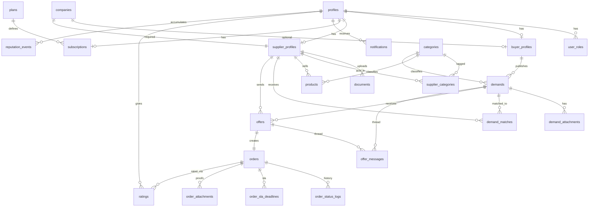

# Schema do Banco de Dados — Keve Marketplace B2B

**Versão:** 1.1 (revisada)  
**Data:** jun/2026  
**Migration init:** `supabase/migrations/20260602100000_init.sql`  
**Seed:** `supabase/seed.sql`

> **Migration RLS:** `supabase/migrations/20260602110000_rls.sql`  
> **Migration triggers:** `supabase/migrations/20260602120000_triggers.sql`  
> **Migration realtime:** `supabase/migrations/20260602130000_realtime.sql`

---

## Visão geral



---

## Domínios e tabelas

| Domínio | Tabelas | Qtd |
|---------|---------|-----|
| Identidade & RBAC | `profiles`, `user_roles` | 2 |
| Empresa & perfis | `companies`, `buyer_profiles`, `supplier_profiles`, `documents` | 4 |
| Catálogo | `categories`, `supplier_categories`, `products` | 3 |
| Billing | `plans`, `subscriptions`, `usage_counters` | 3 |
| Demandas | `demands`, `demand_attachments`, `demand_matches` | 3 |
| Propostas & chat | `offers`, `offer_messages` | 2 |
| Pedidos | `orders`, `order_status_logs`, `order_sla_deadlines`, `order_attachments` | 4 |
| Reputação | `ratings`, `reputation_events` | 2 |
| Notificações | `notifications`, `notification_preferences` | 2 |
| Admin & infra | `audit_logs`, `crm_leads`, `user_push_tokens`, `cnpj_cache`, `idempotency_keys`, `workflow_configs` | 6 |

**Total:** 31 tabelas · 14 enums · 1 function utilitária (`set_updated_at`)

---

## Revisão v1.1 — correções aplicadas

| # | Problema | Correção |
|---|----------|----------|
| 1 | Reputação só no fornecedor | Métricas espelhadas em `buyer_profiles` |
| 2 | `offers` UNIQUE absoluto impedia reenvio após expirar | Índice parcial `WHERE status IN ('enviada','aceita')` |
| 3 | Chat sem thread clara | `offer_messages.supplier_id` + `recipient_id` |
| 4 | Múltiplos pedidos por demanda | `orders.demand_id` UNIQUE |
| 5 | Match reprocessado | `demands.match_processed_at` |
| 6 | Onboarding bloqueava insert | `service_city/uf` nullable até wizard |
| 7 | Enum `notification_channel` não usado | Removido |
| 8 | SKU duplicado no catálogo | UNIQUE parcial `(supplier_id, sku)` |
| 9 | Webhook Asaas lento | Índice em `subscriptions.asaas_customer_id` |
| 10 | Comentário avaliação sem limite | CHECK `char_length <= 500` (PRD) |
| 11 | Board fornecedor lento | Índice `(supplier_id, status)` em matches |
| 12 | LGPD lead inconsistente | CHECK consent + timestamp |

---

## Enums

| Enum | Valores | Uso |
|------|---------|-----|
| `user_role` | buyer, supplier, commercial, admin | RBAC |
| `supplier_status` | pendente, em_revisao, aprovado, recusado | Onboarding fornecedor |
| `demand_status` | RASCUNHO → … → EXPIRADO | Ciclo da demanda |
| `offer_status` | enviada, aceita, rejeitada, expirada, cancelada | Propostas |
| `order_status` | PROPOSTA_ACEITA → … → EXPIRADO | Workflow pós-aceite |
| `subscription_status` | trialing, active, past_due, canceled | Asaas |
| `document_type` | cnpj_card, address_proof, other | Upload onboarding |
| `document_review_status` | pendente, aprovado, recusado | Revisão admin |
| `order_attachment_type` | payment_proof, tracking_info, other | Comprovantes externos |
| `sla_action` | inform_payment, inform_shipping, confirm_delivery, confirm_completion | Prazos 24h |
| `sla_status` | pending, completed, expired | SLA |
| `match_status` | notified, viewed, offer_sent, dismissed | Motor de match |
| `usage_counter_type` | demands_published, offers_sent | Cotas mensais |
| `reputation_event_type` | sla_missed, order_canceled, … | Score |
| `device_type` | ios, android, web | Push tokens (F2) |

> Enums de status usam **snake_case** (offers, orders) ou **UPPER_SNAKE** (demands) conforme camada de negócio.

---

## Detalhamento por tabela

### `profiles`

Perfil base ligado a `auth.users`.

| Coluna | Tipo | Notas |
|--------|------|-------|
| id | uuid PK | FK → `auth.users(id)` CASCADE |
| email | text | Espelhado de auth (trigger futuro) |
| full_name | text | Obrigatório |
| phone | text | |
| avatar_url | text | Storage URL |
| primary_role | user_role | Papel default no login |
| is_active | boolean | default true |

### `user_roles`

Múltiplos papéis por usuário (comprador + fornecedor).

| Coluna | Tipo | Notas |
|--------|------|-------|
| user_id | uuid | PK composta |
| role | user_role | PK composta |

### `companies`

Dados de CNPJ (comprador opcional, fornecedor obrigatório).

| Coluna | Tipo | Notas |
|--------|------|-------|
| cnpj | char(14) | UNIQUE, só dígitos |
| razao_social | text | |
| cidade, uf | text, char(2) | Endereço Receita |

### `buyer_profiles`

| Coluna | Tipo | Notas |
|--------|------|-------|
| company_id | uuid | Opcional |
| avg_rating, total_ratings | numeric, int | Reputação bidirecional (PRD §6.10) |
| orders_completed, cancel_count | int | Métricas públicas |

### `supplier_profiles`

| Coluna | Tipo | Notas |
|--------|------|-------|
| company_id | uuid | UNIQUE — 1 CNPJ = 1 fornecedor |
| status | supplier_status | Match só se `aprovado` |
| verified_at | timestamptz | Selo verificado |
| service_city, service_uf | text | Nullable até onboarding passo 2 |
| service_radius_km | integer | default 50 |
| avg_rating, total_ratings | numeric, int | Desnormalizado (trigger futuro) |
| cancel_count | int | Cancelamentos acumulados |
| response_rate, sla_compliance_rate | numeric | Métricas reputação |

### `demands`

| Coluna | Tipo | Notas |
|--------|------|-------|
| buyer_id | uuid | FK buyer_profiles |
| status | demand_status | default RASCUNHO |
| published_at | timestamptz | Set ao publicar |
| match_processed_at | timestamptz | Idempotência edge fn `match-demand` |
| expires_at | timestamptz | default +30 dias (app/trigger) |
| raio_km | integer | default 50 |

### `demand_matches`

| Coluna | Tipo | Notas |
|--------|------|-------|
| score | integer | Algoritmo match-demand |
| status | match_status | notified → offer_sent |
| UNIQUE | (demand_id, supplier_id) | Idempotência |

### `offers`

| Coluna | Tipo | Notas |
|--------|------|-------|
| valor | numeric(12,2) | |
| validade_ate | timestamptz | Calculado no insert |
| contact_revealed | boolean | Reveal Contact |
| UNIQUE parcial | (demand_id, supplier_id) WHERE status ∈ enviada, aceita | Reenvio após expirada OK |

### `offer_messages`

Thread = `(demand_id, supplier_id)`. Realtime via `20260602130000_realtime.sql`.

| Coluna | Tipo | Notas |
|--------|------|-------|
| demand_id | uuid | Demanda |
| supplier_id | uuid | Fornecedor da thread |
| sender_id / recipient_id | uuid | Remetente e destinatário |
| offer_id | uuid | Nullable — chat pré-proposta |
| blocked_by_filter | boolean | Anti-desintermediação |

### `orders`

| Coluna | Tipo | Notas |
|--------|------|-------|
| offer_id | uuid | UNIQUE — 1 pedido por proposta |
| demand_id | uuid | UNIQUE — 1 pedido por demanda |
| status | order_status | Máquina de estados PRD §6.9 |

### `order_sla_deadlines`

SLA 24h por ação (kickoff).

| Coluna | Tipo | Notas |
|--------|------|-------|
| action | sla_action | Quem deve agir |
| responsible_user_id | uuid | Comprador ou fornecedor |
| reminder_sent_at | timestamptz | Edge fn check-sla-deadlines |

### `plans` / `subscriptions`

| plans.code | Demandas/mês | Propostas/mês | Catálogo | Match priority |
|------------|--------------|---------------|----------|----------------|
| free | 3 | 5 | 10 | — |
| pro | 15 | 30 | 50 | — |
| gold | ∞ (null) | ∞ (null) | 200 | sim |

`subscriptions.user_id` UNIQUE — uma assinatura ativa por usuário.

### `usage_counters`

Contador mensal para cotas. UNIQUE `(user_id, counter_type, period_year, period_month)`.

Catálogo usa contagem de rows em `products` (não counter).

---

## Índices principais

| Tabela | Índice | Motivo |
|--------|--------|--------|
| demands | (status) + partial published | Listagem pública |
| demands | (uf, cidade) | Match geográfico |
| supplier_profiles | (status) | Filtro match |
| demand_matches | (supplier_id) | Board fornecedor |
| offers | (demand_id) | Painel propostas agrupadas |
| offer_messages | (demand_id, created_at) | Chat ordenado |
| order_sla_deadlines | partial pending + deadline_at | Cron SLA |
| notifications | partial unread | Badge in-app |

---

## Relacionamentos críticos

```
auth.users
    └── profiles (1:1)
            ├── user_roles (1:N)
            ├── buyer_profiles (0:1)
            ├── supplier_profiles (0:1)
            │       └── companies (N:1)
            └── subscriptions (0:1) → plans

buyer_profiles → demands → offers → orders
supplier_profiles → demand_matches ← demands
supplier_profiles → products → categories
```

---

## Migrations planejadas (próximas)

| # | Arquivo | Conteúdo |
|---|---------|----------|
| ✅ 1 | `20260602100000_init.sql` | Estrutura base |
| ✅ 2 | `20260602110000_rls.sql` | Helpers SECURITY DEFINER, `v_offers_public`, policies RLS |
| ✅ 3 | `20260602120000_triggers.sql` | Auth signup, cotas, match hook, reveal guard, chat filter, pedidos/SLA, reputação |
| ✅ 4 | `20260602130000_realtime.sql` | Publication `offer_messages`, `notifications` |

---

## Row Level Security (RLS)

Migration `20260602110000_rls.sql` habilita RLS em **todas as 31 tabelas** e define o modelo abaixo.

### Helpers (`SECURITY DEFINER`)

| Função | Uso |
|--------|-----|
| `is_admin()` | Role `admin` |
| `is_staff()` | Roles `admin` ou `commercial` |
| `has_role(role)` | Verifica role do usuário autenticado |
| `is_demand_buyer(id)` | Comprador dono da demanda |
| `is_demand_matched_supplier(id)` | Fornecedor com match ativo |
| `is_demand_participant(id)` | Comprador, match ou quem já enviou proposta |
| `is_order_participant(id)` | Comprador ou fornecedor do pedido |
| `can_view_profile(id)` | Perfil próprio, staff, fornecedor aprovado ou relação comercial |
| `can_view_supplier_contact(supplier, offer)` | Reveal contact (`contact_revealed = true`) ou staff |
| `owns_company(id)` | Empresa vinculada ao buyer/supplier profile |

Funções revogadas de `public` e concedidas a `authenticated`/`anon` para uso em policies e views.

### View `v_offers_public`

- `security_invoker = true` — respeita RLS das tabelas base.
- Mascara `supplier_phone` e `supplier_email` até `can_view_supplier_contact()` retornar true.
- Comprador usa esta view na listagem de propostas; escrita continua na tabela `offers`.

### Matriz de acesso (resumo)

| Área | Leitura | Escrita client |
|------|---------|----------------|
| **Público (anon)** | `categories`, `plans` (ativos) | `crm_leads` (com LGPD) |
| **Perfil & onboarding** | Próprio + relações comerciais | Próprio profile/buyer/supplier; admin aprova supplier |
| **Catálogo** | Produtos de fornecedor aprovado | Supplier dono |
| **Demandas** | Comprador, matched suppliers, staff | Comprador cria/edita; match via service role |
| **Propostas** | Comprador + supplier da proposta | Supplier matched + demanda aberta; buyer reveal |
| **Chat** | Remetente/destinatário | Participantes da thread (proposta ativa) |
| **Pedidos** | Participantes + staff | Buyer cria (proposta aceita); ambos atualizam status |
| **Billing** | Própria subscription + staff | Própria; admin altera plano |
| **Sistema** | Notificações próprias; audit staff | `usage_counters`, `demand_matches`, `idempotency_keys`, `notifications` insert → **service role** |

### Tabelas deny-all para client

Sem policy = bloqueio total para `authenticated`/`anon`:

- `idempotency_keys` — somente edge functions (service role bypassa RLS)

Escrita implícita via service role/triggers (sem policy INSERT/UPDATE client):

- `demand_matches` (insert)
- `usage_counters`
- `order_status_logs` (insert)
- `notifications` (insert)
- `reputation_events` (insert)

### Lacunas removidas (migration triggers)

| Gap | Implementação |
|-----|---------------|
| Buyer altera campos além de reveal em `offers` | `offers_before_write_trg` bloqueia colunas não-reveal |
| Filtro anti-contato no chat | `offer_messages_before_insert_trg` + `contains_blocked_contact()` |
| Sync métricas reputação | `ratings_after_insert_trg` atualiza perfis + `reputation_events` |
| Auth signup → profile + role + subscription Free | `handle_new_user()` em `auth.users` |
| Cotas mensais | `assert_monthly_quota()` + `bump_usage_counter()` |
| Match hook | `invoke_match_demand()` via pg_net (ou Database Webhook) |
| Logs/SLAs de pedido | `orders_after_write_trg` + `is_valid_order_transition()` |

### Configuração opcional (match-demand via pg_net)

```sql
alter database postgres set app.settings.supabase_functions_url = 'https://SEU_PROJETO.supabase.co/functions/v1';
alter database postgres set app.settings.service_role_key = 'SUA_SERVICE_ROLE_KEY';
```

Alternativa recomendada em produção: **Database Webhook** em `demands` UPDATE quando `status = PUBLICADA`.

### Triggers de negócio (resumo)

| Trigger | Tabela | Evento | Ação |
|---------|--------|--------|------|
| `on_auth_user_created` | `auth.users` | INSERT | Profile, role, subscription Free, buyer_profiles |
| `on_auth_user_email_updated` | `auth.users` | UPDATE email | Sync `profiles.email` |
| `demands_before_publish_trg` | `demands` | INSERT/UPDATE | Cota, `published_at`, `expires_at` (+30d) |
| `demands_after_publish_trg` | `demands` | INSERT/UPDATE | Contador + `invoke_match_demand()` |
| `offers_before_write_trg` | `offers` | INSERT/UPDATE | Cota, `validade_ate`, guard reveal, aceite |
| `offers_after_write_trg` | `offers` | INSERT/UPDATE | Contador, match status, notificação, audit reveal |
| `offer_messages_before_insert_trg` | `offer_messages` | INSERT | Anti-contato + auto `offer_id` |
| `orders_before_insert_trg` | `orders` | INSERT | Aceita proposta + status inicial |
| `orders_before_update_trg` | `orders` | UPDATE | Valida transição de status |
| `orders_after_write_trg` | `orders` | INSERT/UPDATE | Logs, SLAs 24h, métricas cancel/concluído |
| `ratings_before_insert_trg` | `ratings` | INSERT | Só se pedido `CONCLUIDO` |
| `ratings_after_insert_trg` | `ratings` | INSERT | Sync avg_rating + reputation_events |
| `demand_matches_before_update_trg` | `demand_matches` | UPDATE | Auto `viewed_at` |

**Aceite de proposta:** comprador cria `orders` com proposta `enviada` → trigger aceita proposta, rejeita concorrentes e abre workflow.

---

## Supabase Realtime

Migration `20260602130000_realtime.sql` adiciona à publication `supabase_realtime`:

| Tabela | Uso | Eventos relevantes |
|--------|-----|-------------------|
| `offer_messages` | Chat comprador ↔ fornecedor (M8) | INSERT, UPDATE (`read_at`) |
| `notifications` | In-app feed + badge (M11) | INSERT, UPDATE (`read_at`) |

`REPLICA IDENTITY FULL` habilitado em ambas para filtros em UPDATE/DELETE respeitarem RLS.

### Padrão de subscription (web/mobile)

**Chat** — thread por `(demand_id, supplier_id)`:

```typescript
supabase
  .channel(`chat:${demandId}:${supplierId}`)
  .on(
    'postgres_changes',
    {
      event: '*',
      schema: 'public',
      table: 'offer_messages',
      filter: `demand_id=eq.${demandId}`,
    },
    (payload) => {
      // filtrar supplier_id no client se necessário
    }
  )
  .subscribe();
```

**Notificações** — feed do usuário autenticado:

```typescript
supabase
  .channel(`notifications:${userId}`)
  .on(
    'postgres_changes',
    {
      event: '*',
      schema: 'public',
      table: 'notifications',
      filter: `user_id=eq.${userId}`,
    },
    handler
  )
  .subscribe();
```

RLS garante que cada client só recebe linhas permitidas pelas policies existentes.

### Anon vs authenticated

- `authenticated`: CRUD conforme policies por tabela.
- `anon`: SELECT em catálogo/planos; INSERT em `crm_leads`. Demais tabelas negadas por RLS.

---

## Comandos locais

```bash
# Iniciar Supabase local
supabase start

# Aplicar migrations + seed
supabase db reset

# Apenas nova migration
supabase migration up

# Gerar types TypeScript (após init)
supabase gen types typescript --local > packages/shared/src/types/database.ts
```

---

## Decisões de modelagem

| Decisão | Motivo |
|---------|--------|
| `profiles.id` = `auth.users.id` | Padrão Supabase |
| `companies` separado de profiles | CNPJ compartilhável futuro; 1 CNPJ = 1 supplier |
| Métricas desnormalizadas em `supplier_profiles` | Evita aggregate pesado em listagens |
| `offer_messages` por `(demand_id, supplier_id)` | Thread comprador ↔ fornecedor |
| `orders.demand_id` UNIQUE | Uma demanda → um pedido fechado |
| Índice parcial em `offers` | Permite nova proposta após expirada |
| `usage_counters` mensal | Cotas demands/offers; catálogo por COUNT |
| `buyer_profiles` + métricas | Reputação bidirecional (kickoff) |
| `workflow_configs` vazio no init | V2 — cenários admin kickoff |
| Sem RLS no init | Migration dedicada `20260602110000_rls.sql` |

---

*Alinhado a [PRD.md](./PRD.md), [MODULOS.md](./MODULOS.md) e [ARQUITETURA.md](./ARQUITETURA.md).*
